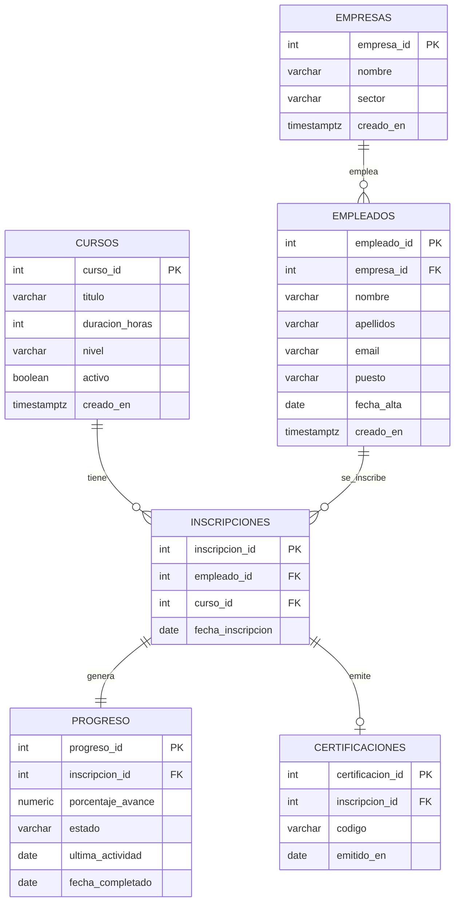

# Solución Ejercicio 2: Sistema de Gestión de Plataforma de Aprendizaje Corporativo

## Parte 1: Diagrama ER



## Código SQL

* [Parte 2: Script para creación de la base de datos](esquema.sql)

* [Parte 3: Script para inserción de datos](datos.sql)

## Consultas para probar la base de datos (opcional)

### 1) Empleados por empresa (ranking)

```sql
SELECT
  e.empresa_id,
  e.nombre AS empresa,
  e.sector,
  COUNT(*) AS num_empleados
FROM empresas e
JOIN empleados emp ON emp.empresa_id = e.empresa_id
GROUP BY e.empresa_id, e.nombre, e.sector
ORDER BY num_empleados DESC, e.nombre;
```

### 2) Cursos más populares (por nº de inscripciones)

```sql
SELECT
  c.curso_id,
  c.titulo,
  c.nivel,
  COUNT(i.inscripcion_id) AS inscripciones
FROM cursos c
LEFT JOIN inscripciones i ON i.curso_id = c.curso_id
GROUP BY c.curso_id, c.titulo, c.nivel
ORDER BY inscripciones DESC, c.titulo;
```

### 3) Tasa de finalización por curso

```sql
SELECT
  c.curso_id,
  c.titulo,
  COUNT(*) FILTER (WHERE p.estado = 'completado') AS completados,
  COUNT(*) AS total_inscripciones,
  ROUND(100.0 * COUNT(*) FILTER (WHERE p.estado = 'completado') / NULLIF(COUNT(*), 0), 2) AS tasa_finalizacion_pct
FROM cursos c
JOIN inscripciones i ON i.curso_id = c.curso_id
JOIN progreso p ON p.inscripcion_id = i.inscripcion_id
GROUP BY c.curso_id, c.titulo
ORDER BY tasa_finalizacion_pct DESC, total_inscripciones DESC;
```

### 4) Tasa de finalización por empresa

```sql
SELECT
  e.empresa_id,
  e.nombre AS empresa,
  COUNT(*) FILTER (WHERE p.estado = 'completado') AS completados,
  COUNT(*) AS total_inscripciones,
  ROUND(100.0 * COUNT(*) FILTER (WHERE p.estado = 'completado') / NULLIF(COUNT(*), 0), 2) AS tasa_finalizacion_pct
FROM empresas e
JOIN empleados emp ON emp.empresa_id = e.empresa_id
JOIN inscripciones i ON i.empleado_id = emp.empleado_id
JOIN progreso p ON p.inscripcion_id = i.inscripcion_id
GROUP BY e.empresa_id, e.nombre
ORDER BY tasa_finalizacion_pct DESC, total_inscripciones DESC;
```

### 5) Progreso medio por curso (promedio del porcentaje)

```sql
SELECT
  c.curso_id,
  c.titulo,
  ROUND(AVG(p.porcentaje_avance), 2) AS progreso_medio_pct
FROM cursos c
JOIN inscripciones i ON i.curso_id = c.curso_id
JOIN progreso p ON p.inscripcion_id = i.inscripcion_id
GROUP BY c.curso_id, c.titulo
ORDER BY progreso_medio_pct DESC;
```
