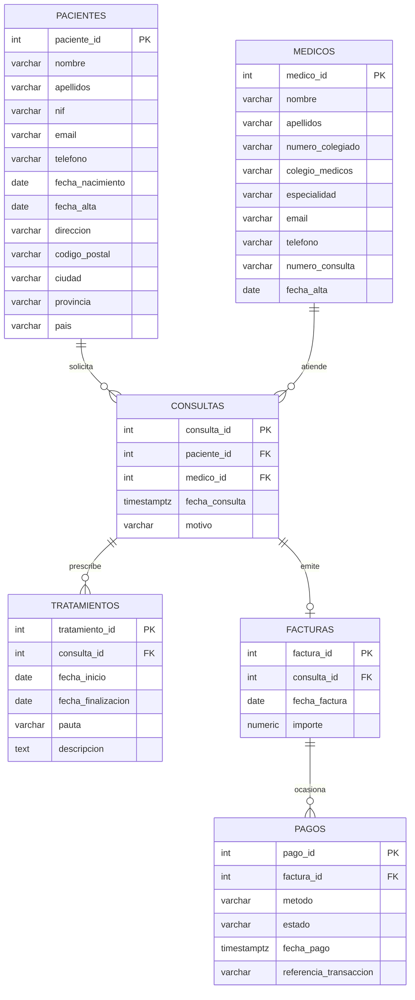

# Solución Ejercicio 1: Sistema de Gestión de Comercio Electrónico Multivendedor

## Parte 1: Diagrama E-R

## Código SQL

* [Parte 2: Script para creación de la base de datos](esquema.sql)

* [Parte 3: Script para inserción de datos](datos.sql)
